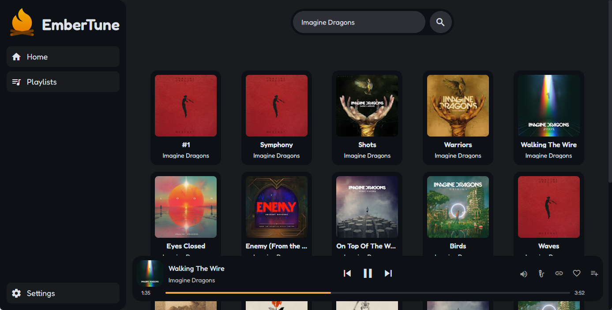

#  EmberTune

<div align="center">
    
</div>

EmberTune is a desktop music player with a focus on design and functionality, EmberTune aims to be a solid alternative to your streaming services without any ads.

<div align="center">
    <a href="https://embertune.dylanakp.dev/">
        
    </a>
</div>

<div align="center"><a href="https://discord.gg/rQBba7a3Sv">Discord Server</a></div>

---

# 🚀 Getting Started

## Step 1: Install Dependencies

Make sure to check [Quasar Documentation](https://quasar.dev/start/quick-start/) before proceeding.

1. Install dependencies:
   ```bash
   yarn install
   ```

## Step 2: Run the Application

Let Quasar launch the development app

```bash
yarn dev
```

# 🤝 Contributing

We welcome contributions to EmberTune! When submitting changes, please follow these guidelines for commit messages:

## Commit Message Format

Each commit message should follow this format:

1. **Headline**: A one-line summary of the change (50 characters maximum)

   - Use prefixes to describe the area changed (e.g., UI, API, Settings)
   - Example: `UI: Adjust PlayBar position`

2. **Body**: If needed, a detailed description that hard-wraps at 72 characters
   - Explain what issue the change solves and how
   - Include any important assumptions or background information
   - This helps other contributors understand the context

For more information on writing good commit messages, check out [How to Write a Git Commit Message](https://cbea.ms/git-commit/).

# 🙌 Credits

- [Alexis06030631](https://github.com/Alexis06030631/) for his [YouTube Music API](https://github.com/Alexis06030631/yt_music_api)
- [MaterialDesignIcons](https://pictogrammers.com/library/mdi/)

---

# 📜 Licenses

- **MaterialDesignIcons**: [MIT License/Apache 2.0](https://pictogrammers.com/docs/general/license/)
- **Fedoka Font**: [SIL OFL 1.1](https://openfontlicense.org/)
- **EmberTune**: [MIT License](https://opensource.org/license/mit)
- **LRCLib**: [MIT License](https://github.com/tranxuanthang/lrclib/blob/main/LICENSE)

---

# ⚠️ Disclaimer

This project and its contents are not affiliated with, funded, authorized, endorsed by, or in any way associated with YouTube, Google LLC or any of its affiliates and subsidiaries.

Any trademark, service mark, trade name, or other intellectual property rights used in this project are owned by the respective owners.
