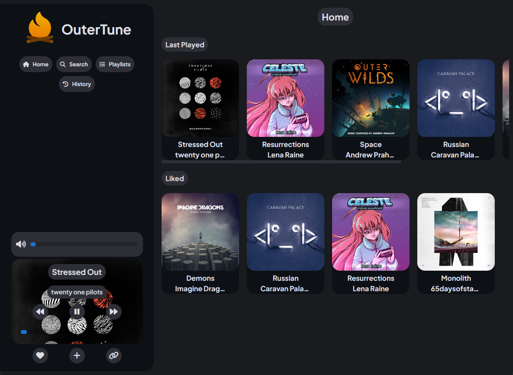

#  EmberTune
 
<div align="center">
    
</div>

EmberTune is a music player for mobile and desktop with a focus on design and functionality, EmberTune aims to be a solid alternative to your streaming services without any ads.

<div align="center">
    <a href="https://github.com/DylanAkp/EmberTune/releases/latest">
        
    </a>
</div>

---

# 🚀 Getting Started

## Step 1: Install Dependencies

Make sure you have completed the [React Native Environment Setup](https://reactnative.dev/docs/environment-setup) for your operating system before proceeding.

1. Install dependencies:
   ```bash
   yarn install
   ```

## Step 2: Run the Application

Let Metro Bundler run in its own terminal. Open a new terminal and run one of the following commands:

```bash
yarn react-native run-<platform>
```

platform can be : `windows`, `android`, `ios` or `macos`
# 🙌 Credits

- [Alexis06030631](https://github.com/Alexis06030631/) for his [YouTube Music API](https://github.com/Alexis06030631/yt_music_api)
- [MaterialDesignIcons](https://pictogrammers.com/library/mdi/)

---

# 📜 Licenses

- **MaterialDesignIcons**: [MIT License/Apache 2.0](https://pictogrammers.com/docs/general/license/)
- **Fedoka Font**: [SIL OFL 1.1](https://openfontlicense.org/)
- **EmberTune**: [MIT License](https://opensource.org/license/mit)

---